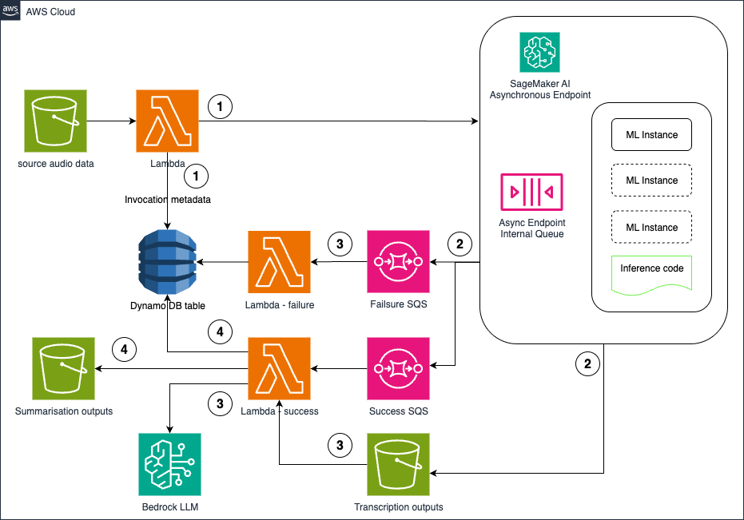

# Serverless Audio Processing with SageMaker Async Inference

A comprehensive AWS CDK solution that demonstrates how to build a scalable, serverless audio processing pipeline using SageMaker asynchronous inference endpoints. This project showcases an event-driven architecture that automatically processes audio files stored in S3, tracks their status, and provides intelligent summarization using Amazon Bedrock.

## Architecture Overview



This solution implements a serverless workflow that processes audio files through multiple stages:

### Core Components

- **Lambda Functions**: Orchestrate the processing workflow and handle status updates
- **DynamoDB**: Provides persistent status tracking and prevents duplicate processing
- **SageMaker Async Inference**: Handles ML model inference for audio transcription
- **SNS Topics**: Enable event-driven communication between services
- **Amazon Bedrock**: Powers AI-driven content summarization and analysis
- **S3 Storage**: Manages input audio files and output transcriptions

## End-to-End Workflow

### 1. Initial Processing (Lambda Trigger)
When the S3 SageMaker Processor Lambda function is invoked with a bucket URI:

- **File Discovery**: Scans the specified S3 bucket and prefix for audio files
- **Duplicate Prevention**: Checks DynamoDB to identify files that haven't been processed
- **Status Initialization**: Creates processing records in DynamoDB with "processing" status
- **Batch Submission**: Submits files to the SageMaker async inference endpoint in optimized batches

### 2. Asynchronous Inference (SageMaker)
The SageMaker async inference endpoint:

- **Queue Management**: Uses an internal queue to handle multiple inference requests
- **ML Processing**: Processes audio files through the deployed ML model (Parakeet ASR)
- **Scalable Compute**: Automatically scales ML instances based on workload demand
- **Output Generation**: Stores transcription results in designated S3 output locations

### 3. Status Tracking and Notifications (SNS + Lambda)
Upon completion or failure:

- **SNS Notifications**: SageMaker publishes status updates to success/failure SNS topics
- **Status Processing**: SNS Status Updater Lambda processes these notifications
- **Database Updates**: Updates DynamoDB records with completion status and output locations
- **Error Handling**: Captures and logs any processing failures for troubleshooting

### 4. Intelligent Summarization (Bedrock Integration)
For successful transcriptions:

- **Content Analysis**: Retrieves transcription outputs from S3
- **AI Summarization**: Uses Amazon Bedrock (Claude 3.5 Sonnet) to generate intelligent summaries
- **Enhanced Metadata**: Stores summarized content alongside original transcriptions

## Key Features

### Scalability & Performance
- **Serverless Architecture**: Automatically scales based on demand without infrastructure management
- **Batch Processing**: Optimizes throughput by processing multiple files simultaneously
- **Async Processing**: Non-blocking workflow allows handling large volumes of audio files

## Prerequisites

Before deploying this solution, ensure you have:

1. **AWS CLI configured** with appropriate permissions
2. **AWS CDK installed** - [Installation Guide](https://docs.aws.amazon.com/cdk/v2/guide/getting_started.html)
3. **Node.js 18+** and **Python 3.9+** installed
4. **SageMaker Endpoint** deployed with your ML model (Parakeet ASR or similar)
5. **SNS Topics** created for success and failure notifications

## Setup and Deployment

### 1. Environment Setup

Clone the repository and install dependencies:

```bash
# Clone the repository
git clone <repository-url>
cd <your-local-path>/sagemaker-async-batch-inference-cdk

# Install Node.js dependencies
npm install

# Set up Python virtual environment
python3 -m venv .venv
source .venv/bin/activate  # On Windows: .venv\Scripts\activate
pip install -r requirements.txt
```

### 2. Configuration

Update the SageMaker endpoint configuration in `bin/aws-blog-sagemaker.ts`:

```typescript
sageMakerConfig: {
  endpointName: 'your-sagemaker-endpoint-name',
  enableSageMakerAccess: true
}
```

### 3. Build and Deploy

```bash
# Compile TypeScript to JavaScript
npm run build

# Bootstrap CDK (first time only)
npx cdk bootstrap

# Review the changes that will be deployed
npx cdk diff

# Deploy the stack
npx cdk deploy
```

### 4. Verify Deployment

After successful deployment, note the output values:
- DynamoDB table name for status tracking
- Lambda function ARNs for processing and status updates
- SNS topic ARNs for notifications

## Usage

### Processing Audio Files

Invoke the S3 SageMaker Processor Lambda function with a bucket URI:

```json
{
  "bucket_uri": "s3://your-bucket-name/audio-files-prefix/"
}
```

### Monitoring Progress

Check processing status in the DynamoDB table:
- **processing**: File submitted to SageMaker
- **submitted**: Successfully queued for inference
- **completed**: Transcription completed successfully
- **failed**: Processing encountered an error

### Sample Data Setup

Use the included script to download and upload sample audio data:

```bash
# Install required dependencies
brew install ffmpeg

# Activate virtual environment and run sample data script
source .venv/bin/activate
python scripts/download_and_upload_dataset.py \
  --bucket your-bucket-name \
  --prefix audio-samples \
  --max-samples 10
```

## Architecture Benefits

### Event-Driven Design
- **Loose Coupling**: Components communicate through events, enabling independent scaling
- **Fault Tolerance**: Failed components don't cascade failures to other parts
- **Extensibility**: Easy to add new processing stages or notification channels

### Serverless Advantages
- **No Infrastructure Management**: Focus on business logic, not server maintenance
- **Automatic Scaling**: Handles traffic spikes without manual intervention
- **Cost Efficiency**: Pay only for actual usage, not idle capacity

### AI/ML Integration
- **Modern AI Stack**: Combines traditional ML (SageMaker) with generative AI (Bedrock)
- **Flexible Model Support**: Easy to swap different ML models for various use cases
- **Intelligent Processing**: Automated summarization adds value beyond basic transcription

## Contributing

This project follows AWS best practices for CDK development:

- **Infrastructure as Code**: All resources defined in version-controlled CDK code
- **Type Safety**: TypeScript ensures compile-time error detection
- **Comprehensive Testing**: Unit and integration tests for both infrastructure and Lambda code
- **Security First**: IAM roles follow principle of least privilege

## Data source
The audio files under the data folder was collected from the internet. The test audio file used for Asynch endpoint was too big for file upload so please replace with your own test file. The 'medical_diarization.wav' was from [here](https://aws-ml-blog.s3.amazonaws.com/artifacts/transcribe_audio_processing/medical-diarization.wav).

## License

This project is licensed under the MIT License - see the LICENSE file for details.

---

*This solution demonstrates modern serverless architecture patterns for AI/ML workloads on AWS, showcasing how to build scalable audio processing pipelines.*