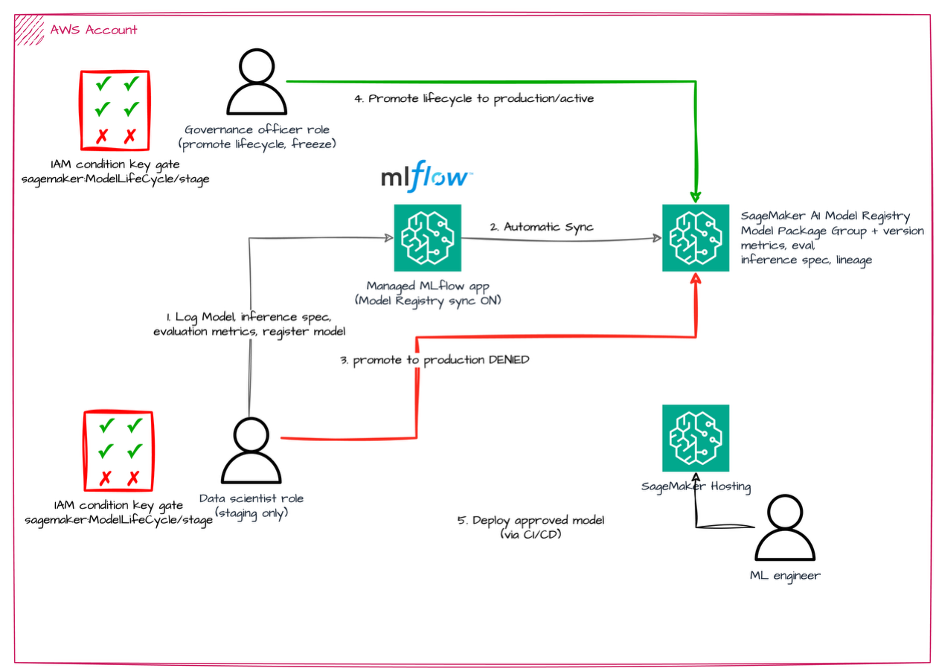
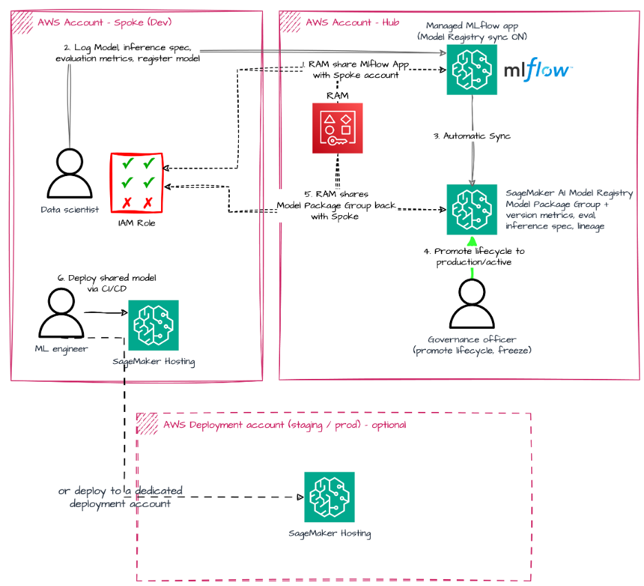
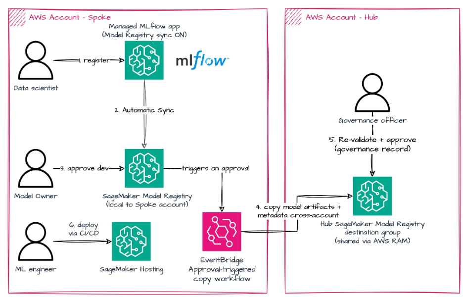

# Model governance with MLflow and the SageMaker AI Model Registry — samples

These samples reproduce the three governance topologies from the post *Govern
models with MLflow and SageMaker AI Model Registry sync*. Each is a runnable,
end-to-end walkthrough backed by infrastructure-as-code, so you can stand up the
environment, execute the flow, and tear it down without guesswork.

Managed MLflow on Amazon SageMaker AI can synchronize models registered in
MLflow into the SageMaker AI Model Registry automatically. With
`AutoModelRegistrationEnabled` set on an MLflow app, a `mlflow.register_model`
call creates a corresponding Model Package Group and version in the Model
Registry, carrying over training metrics, evaluation metrics, a deployable
inference specification, and lineage back to the originating MLflow run. Data
scientists keep using MLflow for experimentation; the organization gets the
Model Registry as the system of record for the production lifecycle.

## Topologies

| # | Topology | Accounts | Governance boundary | Folder |
|---|----------|----------|---------------------|--------|
| 1 | Single-account | One | IAM role | [`topology-1-single-account/`](topology-1-single-account/) |
| 2 | Hub-and-spoke, central | Hub + spoke(s) | Account + AWS RAM | [`topology-2-hub-spoke-central/`](topology-2-hub-spoke-central/) |
| 3 | Hub-and-spoke, hybrid | Hub + spoke(s) | Account + approval-triggered copy | [`topology-3-hub-spoke-hybrid/`](topology-3-hub-spoke-hybrid/) |

Start with Topology 1. It introduces the moving parts — automatic registration,
the lifecycle staging construct, IAM condition-key gates, and deployment from the
registry — in a single account before the cross-account topologies add AWS RAM
sharing on top.

## Notebooks or scripts?

The same material exists in two forms; pick whichever fits how you work:

- **Topology folders (recommended).** Runnable, numbered step scripts backed by
  the CloudFormation template below, with per-step screenshots, expected output,
  and cleanup. Each folder's README is a complete walkthrough.
- **Root-level notebooks** (`01_`–`03_`, one per topology). Self-contained
  Jupyter versions of the same flows for reading or running interactively.
  Update the *Configuration* cell placeholders (`<YOUR_...>`) before running.
  [`05_single_account_governance_e2e_sdk.ipynb`](05_single_account_governance_e2e_sdk.ipynb)
  goes further: it is the end-to-end SDK v3 walkthrough of Topology 1 that also
  deploys the approved model to a real-time endpoint and invokes it — start
  there if you want the complete train → govern → deploy loop in one notebook.

## Running with an AI coding assistant

[`AGENT.md`](AGENT.md) contains the validated, agent-ready operating guide for
this sample: provisioning workflow, per-topology run order and environment
variables, expected outputs, known pitfalls, and safe teardown order. It works
with any assistant (Kiro CLI, Claude Code, Cursor, etc.) — start a session in
this folder and ask it to read `AGENT.md` first. The following prompt has been
validated end-to-end:

> Read AGENT.md, then run the full sample end-to-end (topologies 1-3, spoke
> profile `<spoke-profile>`, hub profile `<hub-profile>`), including cleanup
> and teardown.

Replace `<spoke-profile>` and `<hub-profile>` with your AWS CLI profile names
(see [Account and profile setup](#account-and-profile-setup)). The guide
instructs the assistant to confirm before creating billable resources and to
always finish with the cleanup and teardown steps.

## Architecture at a glance

Each topology is a distinct governance pattern. The diagrams below summarize the
boundary and the flow validated by the runnable walkthroughs; see each topology's
README for the step-by-step detail.

**Topology 1 — single-account.** Boundary is the IAM role; train, govern, and
deploy all in one account.



**Topology 2 — hub-and-spoke, central.** The hub owns the MLflow app and central
registry (RAM-shared to the spoke); models sync into the hub, are approved
centrally, and the spoke deploys the shared, approved model.



**Topology 3 — hub-and-spoke, hybrid.** Each spoke runs its own MLflow app and
registry; a local approval triggers a copy of the approved package into the hub
as a central governance record, while deployment stays in the spoke (no
cross-account artifact access).



## Account and profile setup

The cross-account topologies (2 and 3) use two accounts:

- a **development / spoke** account where data scientists experiment and register
  models, and
- a **hub / governance** account that owns the central Model Registry.

Topology 1 uses a **single** account — the development account is sufficient.
Set up the second account when you move on to topologies 2 and 3.

Configure a named AWS CLI profile per account. Any names work; the samples read
them from your shell. For example, in `~/.aws/config`:

```ini
[profile mlops-dev]
sso_start_url = https://your-sso-portal.awsapps.com/start
sso_region    = us-west-2
sso_account_id = 111111111111
sso_role_name  = Admin
region         = us-west-2

[profile mlops-hub]
sso_start_url = https://your-sso-portal.awsapps.com/start
sso_region    = us-west-2
sso_account_id = 222222222222
sso_role_name  = Admin
region         = us-west-2
```

Verify each profile resolves to the expected account:

```bash
aws sts get-caller-identity --profile mlops-dev
aws sts get-caller-identity --profile mlops-hub
```

> **Region.** The samples were validated in `us-west-2`. Managed MLflow apps and
> Model Registry sync availability vary by Region — confirm the feature is
> available in your Region before deploying elsewhere.

## Provision the environment (CloudFormation)

Each participating account needs a SageMaker AI Studio domain, a user profile, a
scoped execution role, and a managed MLflow app with sync enabled. The template
[`cfn/sagemaker-studio-mlflow.yaml`](cfn/sagemaker-studio-mlflow.yaml) provisions
all of it. It has no required parameters — the defaults produce a working
environment — but you can override the domain name, user profile name, MLflow app
name, and MLflow version.

Deploy into the development account (Topology 1 needs only this one):

```bash
aws cloudformation deploy \
  --template-file cfn/sagemaker-studio-mlflow.yaml \
  --stack-name mlflow-governance \
  --capabilities CAPABILITY_IAM \
  --parameter-overrides \
      DomainName=mlops-dev-domain \
      MLflowAppName=mlflow-dev \
  --profile mlops-dev \
  --region us-west-2
```

For topologies 2 and 3, deploy a second stack into the hub account with distinct
names (for example `DomainName=mlops-hub-domain MLflowAppName=mlflow-hub`).

> The template creates an S3 bucket named `sagemaker-<region>-<account-id>` as the
> MLflow artifact store. If that bucket already exists in the account/Region,
> either delete it first or adapt the template to a different name.

### Read the outputs

The two values every sample needs are in the stack outputs:

```bash
aws cloudformation describe-stacks \
  --stack-name mlflow-governance \
  --query "Stacks[0].Outputs[?OutputKey=='MLflowAppArn' || OutputKey=='SageMakerExecutionRoleArn'].[OutputKey,OutputValue]" \
  --output table \
  --profile mlops-dev --region us-west-2
```

You will export these as `MLFLOW_APP_ARN` and `EXECUTION_ROLE` in each topology's
walkthrough.

## What the template provisions

| Resource | Purpose |
|----------|---------|
| SageMaker AI Studio domain + user profile | Where the MLflow UI and Model Registry are viewed |
| Execution role | Runs training jobs, performs the sync, hosts the endpoint. `AmazonSageMakerFullAccess` + MLflow app actions + artifact-store S3 access |
| MLflow app (`AutoModelRegistrationEnabled`) | Experiment tracking **and** automatic sync into the Model Registry |
| S3 bucket | MLflow artifact store |

> **On the shared execution role.** For clarity the template uses one execution
> role for training, the MLflow app service role, and endpoint hosting. In
> production, separate these and scope each to least privilege. Topology 1's
> walkthrough shows the persona split — a data-scientist role gated by IAM
> condition keys and a governance-officer role — that expresses the approval
> boundary.

## Cleaning up

Each topology has a cleanup script for the resources it creates (endpoints,
models, registry entries). To remove the shared infrastructure, delete the
CloudFormation stack:

```bash
aws cloudformation delete-stack --stack-name mlflow-governance --profile mlops-dev --region us-west-2
```

If stack deletion stalls on the Studio domain, delete any running Studio
applications and spaces in the domain first, then retry. The artifact-store
bucket must be empty before it can be removed.

## Costs

These samples create billable resources: managed MLflow apps (billed while
running), SageMaker AI Studio domains, S3 storage, SageMaker Training Jobs, and
`ml.m5.xlarge` real-time endpoints (billed per instance-hour). Run each
topology's cleanup step promptly after the deploy step, and delete the
CloudFormation stacks when you are done.

## Security

The IAM roles in the CloudFormation template are scoped for a sample walkthrough;
review and tighten them to least privilege before using this pattern in
production (see the note on the shared execution role above).

## License

This sample is licensed under the MIT-0 License.
