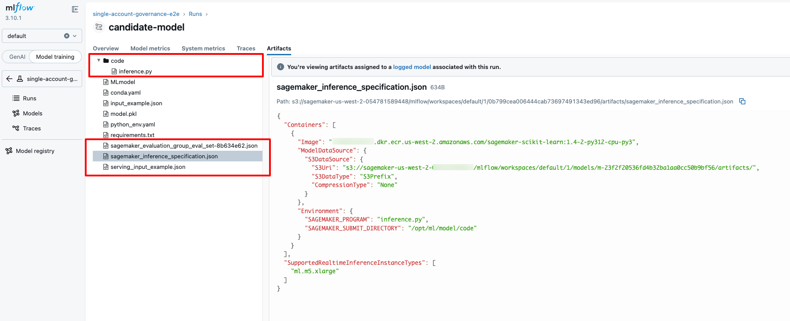
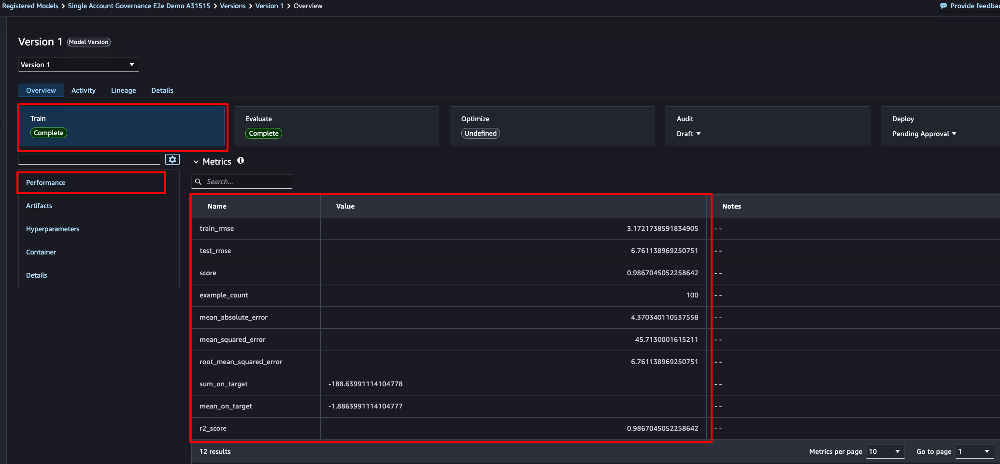
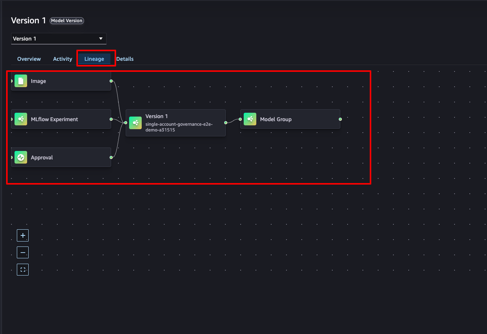
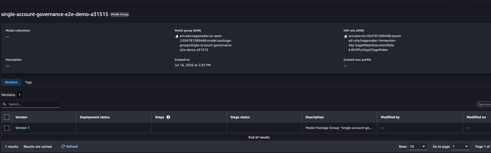
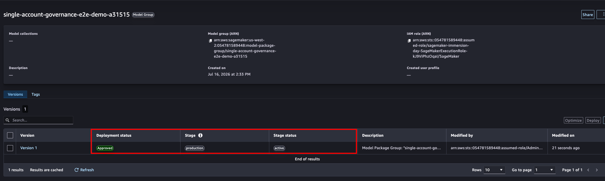

# Topology 1 — Single-account governance

In the simplest topology, data scientists and the governance officer work in the
**same account**. There is no account boundary to cross: the governance boundary
is the **IAM role**. A data scientist can register models and move them to
*staging*, but only the governance officer can promote a model to *production*
and approve it for deployment. This fits smaller teams and early-stage projects
where account separation is not yet warranted, and it introduces every building
block the cross-account topologies reuse.

## Architecture


*One account. The governance boundary is the IAM role: a data scientist trains,
registers, and stages the model, while promotion to production and approval for
deployment are reserved for the governance officer. Deployment runs in the same
account.*

This walkthrough takes a candidate model from experiment to a live endpoint:

```
1. Train + register  ── @remote training job logs metrics, an evaluation card,
   (data scientist)      and an inference spec to MLflow, then registers the model.
                         Model Registry sync creates the Model Package Group and
                         version automatically, with metadata and lineage intact.

2. Govern lifecycle  ── Data scientist moves the model to staging (allowed).
                         A production promotion from the data-scientist role is
                         DENIED by an IAM condition key. The governance officer
                         promotes to production and approves for deployment.

3. Deploy + invoke   ── Deploy the approved Model Package directly from the
                         registry to a real-time endpoint and invoke it.

4. Clean up          ── Delete the endpoint and registry entries.
```

## Prerequisites

### 1. Provisioned environment

You need the SageMaker AI Studio domain, execution role, and MLflow app from the
shared CloudFormation stack. If you have not deployed it yet, follow
[`../README.md`](../README.md) → *Provision the environment*, then come back here.

You will need two stack outputs:

- `MLflowAppArn` — the MLflow app ARN (also the MLflow tracking URI)
- `SageMakerExecutionRoleArn` — the execution role ARN

### 2. Python environment

Use Python 3.12, matching the `py312` scikit-learn container the training job and
endpoint run on. Create a virtual environment and install the pins:

```bash
python3.12 -m venv .venv
source .venv/bin/activate
pip install -r requirements.txt
```

The same `requirements.txt` is shipped to the `@remote` training job, so the job
environment matches your client — the model pickled in the job unpickles cleanly
on the endpoint.

### 3. Credentials

Export your development-account profile and Region, plus the two stack outputs.
`EXECUTION_ROLE` **must be set explicitly** — see the note below.

```bash
export AWS_PROFILE=mlops-dev
export AWS_DEFAULT_REGION=us-west-2
export MLFLOW_APP_ARN=<MLflowAppArn output>
export EXECUTION_ROLE=<SageMakerExecutionRoleArn output>

# Optional — defaults to single-account-governance-demo
export MODEL_NAME=single-account-governance-demo
```

> **Why `EXECUTION_ROLE` is explicit.** Inside a Studio JupyterLab space the SDK
> can discover the role with `get_execution_role()`. When you run these scripts
> from a laptop, that call resolves to your *caller* identity — often a federated
> admin role that SageMaker cannot assume for training or hosting. Passing the
> role explicitly makes the sample behave identically in Studio and on a laptop.

The scripts run a **preflight check** on startup: they verify your credentials
resolve, the MLflow app exists, and (for steps 1–2) that
`ModelRegistrationMode = AutoModelRegistrationEnabled`. If a prerequisite is
missing, the script prints the exact command to fix it and exits.

## Running the walkthrough

Run each step from this directory (`topology-1-single-account/`) so the
relative paths resolve:

```bash
python scripts/01_train_and_register.py
python scripts/02_govern_lifecycle.py
python scripts/03_deploy_and_invoke.py
python scripts/04_cleanup.py
```

State (the model version and Model Package ARN) is written to
`scripts/.sample_state.json` so each step picks up where the previous one left
off.

---

### Step 1 — Train and register

```bash
python scripts/01_train_and_register.py
```

Trains a `RandomForestRegressor` as a SageMaker AI Training Job via the SDK v3
`@remote` decorator. Inside the job it logs real train/test RMSE, an evaluation
model card, and an **inference specification**, then calls
`mlflow.register_model`. Because sync is enabled, that register call creates the
Model Package Group and version in the Model Registry automatically.

Expected tail:

```
Registered and synced:
  Registered model:      single-account-governance-demo v1
  train_rmse:            3.17
  test_rmse:             6.76
  SageMaker package ARN: arn:aws:sagemaker:...:model-package/single-account-governance-demo-<hash>/1
```

> **The group name gets a hash suffix.** Automatic registration appends a short
> hash to the group name (`single-account-governance-demo` →
> `single-account-governance-demo-<hash>`). Discover it with
> `list_model_package_groups(NameContains=...)` rather than assuming the bare
> name.

**What you'll see in MLflow** — the run's artifacts include `model.pkl`, the
injected `code/inference.py`, and `sagemaker_inference_specification.json`. The
inference spec is what makes the model directly deployable in Step 3.



**What you'll see in the Model Registry** — the synced Model Package version
carries the training and evaluation metrics; Train and Evaluate show *Complete*,
Deploy shows *Pending Approval*.



**Lineage** links the container image, the MLflow experiment, and the approval
action to the model version and its group — no manual wiring.



---

### Step 2 — Govern the lifecycle

```bash
python scripts/02_govern_lifecycle.py
```

The lifecycle stage is driven by MLflow **aliases** using the convention
`sagemakerlifecycle-{stage}-{status}`; setting an alias updates the SageMaker AI
Model Package lifecycle automatically. The script performs three actions:

1. **Data scientist → staging** (`sagemakerlifecycle-staging-pending`). Allowed.
2. **Data scientist → production.** Denied, verified with an IAM policy
   simulation of the data-scientist guardrail (see *The governance model* below).
3. **Governance officer → production + approve.** Sets
   `sagemakerlifecycle-production-active` and the Model Package approval status to
   `Approved`.

Expected output:

```
[1] Data scientist set 'sagemakerlifecycle-staging-pending' (allowed).
[2] Data-scientist production promotion -> IAM decision: explicitDeny
    Guardrail verified: data scientists cannot promote to production.
[3] Governance officer set 'sagemakerlifecycle-production-active' and approved for deployment.
    Approval status:  Approved
```

**What you'll see** — the model version moves from staging/pending to
production/active, and the approval status flips to *Approved*. Approval status
is a **separate attribute** from lifecycle stage, so promotion and deployment
readiness remain distinct decisions.

| Staging (pending) | Production (active, approved) |
|---|---|
|  |  |

---

### Step 3 — Deploy from the registry and invoke

```bash
python scripts/03_deploy_and_invoke.py
```

Deploys the approved Model Package **directly from the registry** to a real-time
endpoint using SDK v3 typed resources (`Model`, `EndpointConfig`, `Endpoint`),
then invokes it. The script refuses to deploy a package that is not `Approved`,
mirroring the governance gate. This is the same flow the **Deploy** button in
Studio drives — expressed as code a CI/CD pipeline can run on the approval event.

Expected output:

```
Model Package is Approved: arn:aws:sagemaker:...:model-package/single-account-governance-demo-<hash>/1
Created model:           single-account-governance-demo-<timestamp>
Created endpoint config: single-account-governance-demo-<timestamp>
Creating endpoint single-account-governance-demo-<timestamp> (a few minutes)...
Endpoint is InService.
Prediction: [34.59, 20.17]
```

> **Cost.** This creates an `ml.m5.xlarge` real-time endpoint. Run Step 4 as soon
> as you have what you need — the endpoint bills per instance-hour while it runs.

---

### Step 4 — Clean up

```bash
python scripts/04_cleanup.py
```

Deletes the endpoint (first, since it bills), the endpoint config, the model,
every Model Package in the group, the group, and the MLflow registered model. To
remove the domain, MLflow app, and role, delete the CloudFormation stack (see the
root README).

## The governance model

The boundary in this topology is the **IAM role**, enforced with two condition
keys that the Model Registry lifecycle exposes:

| Condition key | Values |
|---|---|
| `sagemaker:ModelLifeCycle/stage` | `staging`, `production` |
| `sagemaker:ModelLifeCycle/stageStatus` | `pending`, `active` |

The **data-scientist guardrail** denies any lifecycle transition to production.
Attach it to the execution role of the data scientists' Studio user profiles; the
governance-officer profile's role omits it:

```json
{
  "Version": "2012-10-17",
  "Statement": [{
    "Sid": "DenyProductionPromotion",
    "Effect": "Deny",
    "Action": "sagemaker:UpdateModelPackage",
    "Resource": "*",
    "Condition": {
      "StringEquals": { "sagemaker:ModelLifeCycle/stage": "production" }
    }
  }]
}
```

The sample verifies this guardrail with an IAM **policy simulation** so it stays
self-contained (no second role to assume). In a real deployment you attach the
policy to the data-scientist role and grant the governance-officer role the
unrestricted `sagemaker:UpdateModelPackage`.

> **Enforcement nuance.** The condition key gates direct `UpdateModelPackage`
> calls (CLI, SDK, pipeline). Lifecycle transitions driven through an MLflow
> alias execute under the **MLflow app's service role**, not the caller's role,
> so the deny above does not cover that path. To close it, restrict who can set
> lifecycle aliases at the MLflow layer with the
> `sagemaker-mlflow:SetRegisteredModelAlias` and
> `sagemaker-mlflow:DeleteRegisteredModelAlias` IAM actions, reserving them for
> the governance-officer role.

To lock an approved model against further change, apply a resource tag to the
Model Package Group and add a matching IAM condition that denies updates to
tagged groups. Lifecycle changes also emit events to Amazon EventBridge and are
recorded as an audit trail, which you can route into your existing governance
tooling.

## Troubleshooting

| Symptom | Cause / fix |
|---|---|
| `MLFLOW_APP_ARN is not set` (or `EXECUTION_ROLE`) | Export the stack outputs. The error prints the exact `export` command. |
| `ModelRegistrationMode is 'Disabled'` | The MLflow app does not have sync on. The error prints the `update-mlflow-app` command to enable it. |
| `Unsupported sklearn version: 1.4-2` | SDK version mismatch. Ensure `sagemaker>=3,<4` from `requirements.txt`; the image tag is `1.4-2-py312`. |
| Endpoint never reaches InService | The inference script or `SAGEMAKER_PROGRAM` env is missing from the model artifacts. Re-run Step 1 — it uploads `code/inference.py` and sets the env in the inference spec. |
| `Default image is supported only for Python versions 3.8 and 3.10` | Only affects `@remote` when no `image_uri` is set. Step 1 passes an explicit py312 training image, so this should not occur; if you removed that, restore `image_uri=SKLEARN_IMAGE` on the `@remote` decorator. |
| Group delete fails: *still contains Model Packages* | Package deletion is eventually consistent. The cleanup script polls until the group is empty; if you delete manually, wait a few seconds and retry. |
