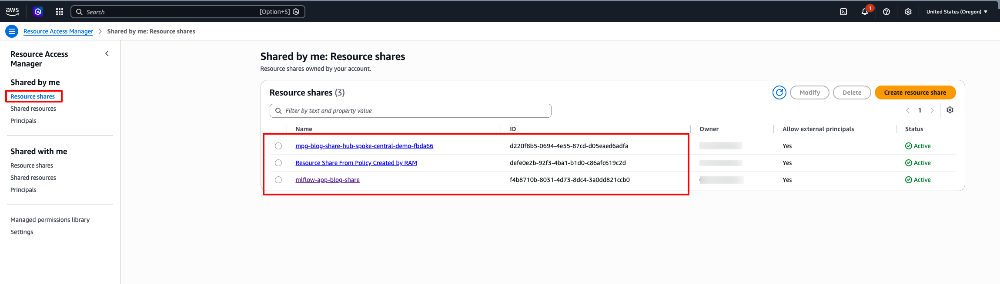
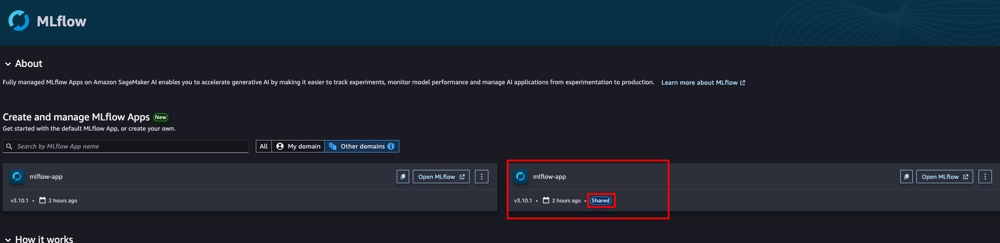
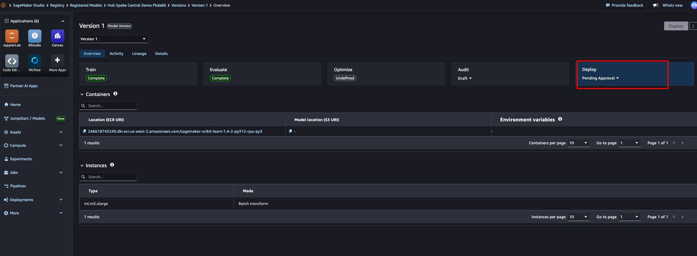
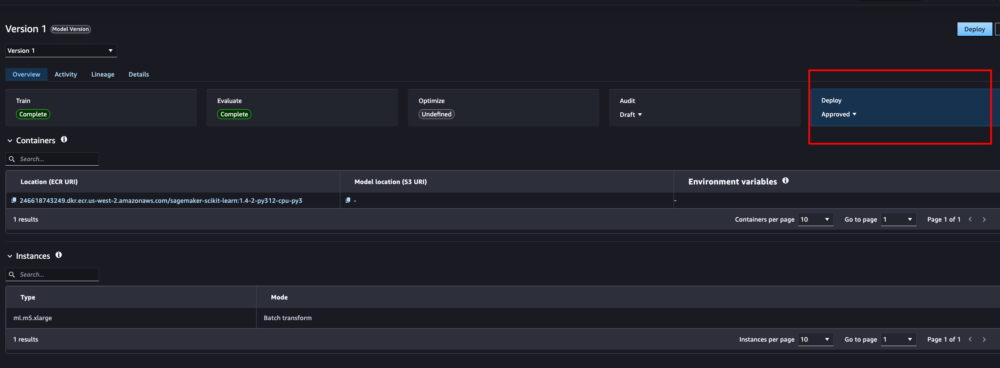

# Topology 2 — Hub-and-spoke central governance

Larger organizations separate development accounts from a central governance
account. In this topology the managed MLflow app and the central Model Registry
live in a **hub** account, and the hub shares the MLflow app with one or more
**spoke** (development) accounts using AWS Resource Access Manager (AWS RAM).
Data scientists in a spoke register candidate models against the shared MLflow
app; automatic registration creates the corresponding Model Package Group and
version **in the hub**, synchronously with the register call. The governance
officer validates and approves every candidate centrally in the hub.

The governance boundary here is the **account plus AWS RAM** — a step up from
Topology 1, where the boundary was an IAM role within a single account.

## Architecture


*The hub owns the managed MLflow app and the central Model Registry. The app is
RAM-shared to the spoke, so a spoke data scientist registers against it and
automatic sync creates the Model Package Group **in the hub**. The group is
RAM-shared back (`AllowDeploy`); the governance officer approves centrally, and
the spoke deploys the shared, approved model in its own account.*

This walkthrough:

```
Hub account                                Spoke (development) account
-----------                                ---------------------------
1. Bucket policy + RAM-share the  ───────> Accept the invitation
   MLflow app
2.                                         Register a model on the shared app
   [automatic registration creates the Model Package Group in the HUB]
   RAM-share the group back  ────────────> Accept; can now describe/deploy it
   (AllowDeploy)
3. Governance officer promotes
   to production + approves
4.                                         Deploy the shared, approved model to
                                           a real-time endpoint and invoke it
5. Clean up both accounts
```

## Prerequisites

### 1. Two provisioned accounts

Deploy the shared CloudFormation stack (see [`../README.md`](../README.md)) into
**both** accounts, with distinct MLflow app names — for example:

```bash
# Hub
aws cloudformation deploy --template-file ../cfn/sagemaker-studio-mlflow.yaml \
  --stack-name mlflow-governance --capabilities CAPABILITY_IAM \
  --parameter-overrides DomainName=mlops-hub-domain MLflowAppName=mlflow-hub \
  --profile mlops-hub --region us-west-2

# Spoke
aws cloudformation deploy --template-file ../cfn/sagemaker-studio-mlflow.yaml \
  --stack-name mlflow-governance --capabilities CAPABILITY_IAM \
  --parameter-overrides DomainName=mlops-dev-domain MLflowAppName=mlflow-dev \
  --profile mlops-dev --region us-west-2
```

You need three values:

- the **hub** stack's `MLflowAppArn` output → `HUB_MLFLOW_APP_ARN`
- the **spoke** stack's `SageMakerExecutionRoleArn` output → `SPOKE_EXECUTION_ROLE`
- both account profiles

> The spoke's own MLflow app is not used in this topology — data scientists
> register against the hub's shared app. It is provisioned anyway because the
> same stack serves Topologies 1 and 3.

### 2. Python environment

```bash
python3.12 -m venv .venv && source .venv/bin/activate
pip install -r requirements.txt
```

### 3. Credentials

```bash
export HUB_PROFILE=mlops-hub
export SPOKE_PROFILE=mlops-dev
export AWS_DEFAULT_REGION=us-west-2
export HUB_MLFLOW_APP_ARN=<hub stack MLflowAppArn>
export SPOKE_EXECUTION_ROLE=<spoke stack SageMakerExecutionRoleArn>

# Optional — defaults to hub-spoke-central-demo
export MODEL_NAME=hub-spoke-central-demo
```

The scripts preflight-check that both profiles resolve and the hub MLflow app has
`AutoModelRegistrationEnabled`, printing the fix command if not.

## Running the walkthrough

Run each step from this directory (`topology-2-hub-spoke-central/`):

```bash
python scripts/01_share_mlflow_app.py
python scripts/02_register_from_spoke.py
python scripts/03_govern_in_hub.py
python scripts/04_deploy_from_spoke.py
python scripts/05_cleanup.py
```

---

### Step 1 — Hub shares the MLflow app

Attaches a cross-account bucket policy to the hub's artifact store (so the spoke
can write artifacts on registration and read them at deploy time) and RAM-shares
the MLflow app to the spoke, which accepts.

**What you'll see** — in the hub's RAM console under *Shared by me*, the MLflow
app share is Active with external principals enabled.



In the spoke's SageMaker console, the hub's MLflow app appears with a **Shared**
badge — one app, two accounts.



---

### Step 2 — Spoke registers on the shared app

The spoke data scientist logs a run and registers against the hub app.
Automatic registration creates the Model Package Group and version **in the
hub**. The hub then attaches a resource policy to the group and RAM-shares it
back with the `AllowDeploy` managed permission; the spoke accepts.

> **Two shares, two permissions.** The app share lets the spoke *register* into
> the hub. The group share-back with `AllowDeploy` lets the spoke *describe and
> deploy* the hub-owned package. The resource policy additionally grants
> `CreateModel`, which `AllowDeploy` alone does not include.

> **Hash suffix.** As in every topology, the synced group name gets a short hash
> suffix; the script discovers it with `list_model_package_groups(NameContains=...)`
> and references it cross-account by full ARN.

**What you'll see** — the spoke-registered model appears in the **hub's** Model
Registry, pending approval, with the metrics, evaluation card, and lineage from
the spoke's run.



---

### Step 3 — Govern centrally in the hub

The governance officer (hub credentials) promotes the model to
`production/active` via an MLflow alias and sets the Model Package approval
status to `Approved`. This single control point governs candidates from every
spoke.

**What you'll see** — the model in the hub registry moves to production/active
and Approved.



---

### Step 4 — Spoke deploys the shared, approved model

The spoke deploys the hub-owned Model Package (shared via `AllowDeploy`) to a
real-time endpoint and invokes it. The script refuses to deploy a package that
is not `Approved`.

> **Cross-account artifact access — the piece the RAM share does not cover.**
> The model artifacts live in the **hub's** S3 artifact store. For the spoke
> endpoint to pull them, access is needed on **both** sides:
>
> - **Resource side:** the hub bucket policy grants the spoke account
>   `s3:GetObject` (applied in Step 1).
> - **Identity side:** the spoke execution role needs `s3:GetObject` on the hub
>   bucket. `AmazonSageMakerFullAccess` grants S3 access to buckets whose name
>   contains `sagemaker`, which covers `sagemaker-<region>-<hub-account>`. If you
>   scope the spoke role more tightly, add the hub bucket explicitly.
>
> This is the deployment analogue of the sharing the topology already does for
> metadata: RAM shares the *registry entry*; the *artifacts* still need explicit
> S3 cross-account access.

Expected tail:

```
Shared Model Package is Approved: arn:aws:sagemaker:...:<hub>:model-package/hub-spoke-central-demo-<hash>/1
Creating endpoint hub-spoke-central-demo-<timestamp> in the spoke (a few minutes)...
Endpoint is InService.
Prediction: [34.59, 20.17]
```

> **Cost.** Creates an `ml.m5.xlarge` endpoint in the spoke. Run Step 5 promptly.

---

### Step 5 — Clean up

Deletes the spoke endpoint/config/model, the hub RAM shares, the hub Model
Packages and group, and the hub MLflow registered model. Delete the two
CloudFormation stacks to remove the domains, MLflow apps, and roles.

## The governance model

| Concern | Mechanism |
|---|---|
| Who can register into the hub registry | RAM share of the MLflow app to the spoke |
| Who can deploy hub-owned models | RAM share of the group back to the spoke (`AllowDeploy`) + `CreateModel` in the resource policy |
| Where approval happens | Centrally in the hub — the spoke cannot approve |
| Cross-account artifact reads | Hub bucket policy (resource) + spoke role S3 permission (identity) |
| Audit trail | Lifecycle changes emit EventBridge events in the hub |

Because data scientists stay in MLflow, every candidate they register
appears automatically in the hub's central registry with its metrics, evaluation
card, inference specification, and lineage — giving the governance officer one
authoritative view across development teams while experimentation stays
self-service.

## Troubleshooting

| Symptom | Cause / fix |
|---|---|
| `HUB_MLFLOW_APP_ARN`/`SPOKE_EXECUTION_ROLE` not set | Export the stack outputs; the error prints the exact command. |
| Registration fails with S3 AccessDenied | The hub bucket policy is missing. Re-run Step 1. |
| Endpoint never reaches InService (spoke) | Cross-account artifact access. Confirm the hub bucket policy (Step 1) and that the spoke execution role can read the hub bucket (see Step 4 note). |
| `describe_model_package` AccessDenied in the spoke | The group share-back (Step 2) was not accepted. Check RAM *Shared with me* in the spoke. |
| Group delete fails: *still contains Model Packages* | Package deletion is eventually consistent; the cleanup script polls before deleting the group. |
