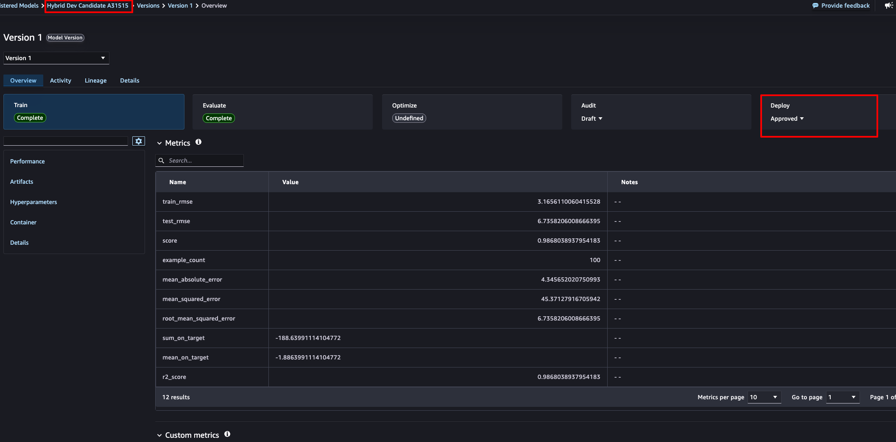
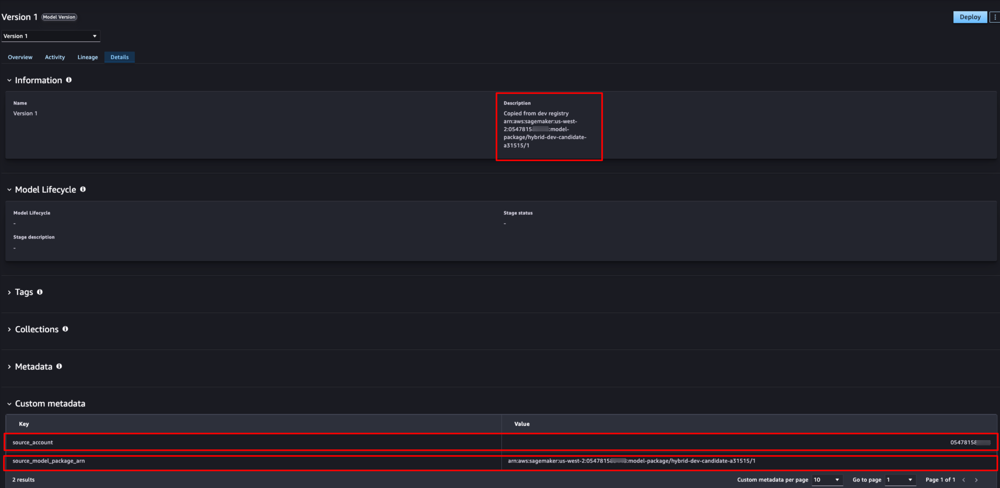

# Topology 3 — Hub-and-spoke hybrid governance

Some regulated organizations treat the hub as a production-grade account and do
**not** want data scientists writing into it, even indirectly. Topology 3 keeps
each development account fully self-contained: it runs its **own** MLflow app and
Model Registry (the Topology 1 pattern, local to the spoke). Only when a model is
approved locally does an approval-triggered workflow **copy** the approved Model
Package into the hub registry, cross-account. Data scientists have no write
access to the hub; only the approved artifact crosses the boundary.

Deployment stays **local to the spoke**, which already owns the model and its
artifacts. The hub copy is a central **governance record** — an independent
inventory of approved models with its own hub sign-off — not a deployment
source, so the hub keeps no runtime dependency on the spoke.

The governance boundary here is the **account plus an approval-triggered copy** —
the strongest isolation of the three topologies.

## Architecture


*Each spoke runs its own MLflow app and Model Registry. The data scientist
registers and the model owner approves **locally**; that approval triggers an
(EventBridge-driven) copy of the approved package into the hub's destination
group, where the governance officer re-validates and approves as a central
record. Deployment stays **in the spoke** from its own local approved package —
so the hub holds a governance copy but keeps no runtime dependency on the spoke.*

This walkthrough:

```
Spoke (development) account                 Hub account
---------------------------                 -----------
                                       1.   Create destination group + resource
                                            policy + RAM-share it (AllowRegister)
   Accept the invitation  <─────────────────┘
2. Register on the spoke's OWN app
   [automatic registration -> SPOKE registry]
   Dev owner approves locally  (the trigger)
3. Copy the approved package  ────────────>  Lands in the hub destination group
   into the hub (CreateModelPackage)         as PendingManualApproval, with
                                             provenance metadata
4.                                     Governance officer re-validates + approves
                                            (central governance record)
5. Deploy the spoke-local approved
   package to a real-time endpoint
   (in the spoke; no cross-account
   artifact access)
6. Clean up
```

## Prerequisites

### 1. Two provisioned accounts

Deploy the shared CloudFormation stack (see [`../README.md`](../README.md)) into
**both** accounts. Topology 3 uses the **spoke's own** MLflow app (unlike
Topology 2, which uses the hub's):

```bash
# Spoke (its MLflow app IS used here)
aws cloudformation deploy --template-file ../cfn/sagemaker-studio-mlflow.yaml \
  --stack-name mlflow-governance --capabilities CAPABILITY_IAM \
  --parameter-overrides DomainName=mlops-dev-domain MLflowAppName=mlflow-dev \
  --profile mlops-dev --region us-west-2

# Hub (only its Model Registry is used; the MLflow app is idle in this topology)
aws cloudformation deploy --template-file ../cfn/sagemaker-studio-mlflow.yaml \
  --stack-name mlflow-governance --capabilities CAPABILITY_IAM \
  --parameter-overrides DomainName=mlops-hub-domain MLflowAppName=mlflow-hub \
  --profile mlops-hub --region us-west-2
```

You need the **spoke** stack's `MLflowAppArn` output and both account profiles.
Step 5 (deploy in the spoke) additionally needs the **spoke** stack's
`SageMakerExecutionRoleArn` output.

### 2. Python environment

```bash
python3.12 -m venv .venv && source .venv/bin/activate
pip install -r requirements.txt
```

### 3. Credentials

```bash
export HUB_PROFILE=mlops-hub
export SPOKE_PROFILE=mlops-dev
export AWS_DEFAULT_REGION=us-west-2
export SPOKE_MLFLOW_APP_ARN=<spoke stack MLflowAppArn>

# Required only for Step 5 (deploy in the spoke)
export SPOKE_EXECUTION_ROLE=<spoke stack SageMakerExecutionRoleArn>

# Optional
export MODEL_NAME=hybrid-dev-candidate
export HUB_DEST_MPG=hub-central-registry-from-dev
```

The scripts preflight-check that both profiles resolve and the **spoke** MLflow
app has `AutoModelRegistrationEnabled`.

## Running the walkthrough

Run each step from this directory (`topology-3-hub-spoke-hybrid/`):

```bash
python scripts/01_hub_setup.py
python scripts/02_register_in_spoke.py
python scripts/03_copy_to_hub.py
python scripts/04_approve_in_hub.py
python scripts/05_deploy_from_spoke.py
python scripts/06_cleanup.py            # add --remove-hub-group to also delete the hub group
```

---

### Step 1 — Hub exposes a destination group

The hub creates a destination Model Package Group, attaches a resource policy
allowing the spoke account to `CreateModelPackage` into it, and RAM-shares it
with the **`AllowRegister`** managed permission (the permission designed for
registering new versions into a shared group — distinct from Topology 2's
`AllowDeploy`). The spoke accepts. This is one-time hub setup, reused across many
development cycles.

---

### Step 2 — Register and approve in the spoke

The data scientist registers against the **spoke's own** MLflow app; automatic
registration syncs the model into the spoke's local Model Registry — the hub is
untouched. The development account's model owner approves it locally, which is
the trigger for promotion to the hub.

**What you'll see** — the model approved in the spoke's own registry.



---

### Step 3 — Copy the approved model into the hub

Reads the approved package from the spoke and calls `CreateModelPackage` against
the hub's shared destination group, with spoke credentials. Only the approved
package crosses the boundary. The copy carries the inference specification and
records `CustomerMetadataProperties` pointing back to the source package and
account, and it lands as `PendingManualApproval` so the hub re-validates.

> **Copy, not sync — and the difference matters.** Unlike Topology 2, nothing is
> automatically synchronized into the hub. The copy is an explicit
> `CreateModelPackage` call, so the hub package is an independent record. Because
> native SageMaker lineage does not cross account boundaries, provenance is
> recorded manually as `CustomerMetadataProperties` (source ARN + account). In
> production, trigger this from an Amazon EventBridge rule on the spoke package's
> state change to `Approved`, rather than calling it inline.

**What you'll see** — the copied package in the hub, with the source-provenance
custom metadata.



---

### Step 4 — Re-validate and approve in the hub

The governance officer sees the copied package (with provenance), validates it,
and approves it independently. The hub made its own decision; it stayed isolated
from day-to-day development. This hub approval is a **central governance record**
(a compliance inventory of approved models) — it is not the deployment gate.
Deployment is governed by the spoke's own local approval (Step 2) and happens in
the spoke (Step 5).

---

### Step 5 — Deploy the approved model in the spoke

The spoke owns the model end-to-end — it trained it, registered it in its own
Model Registry, and approved it locally — so it also deploys it, to a real-time
endpoint **in the spoke**, and invokes it. The script refuses to deploy a package
that is not `Approved` in the spoke, mirroring the local governance gate.

> **No cross-account artifact access.** The model artifacts already live in the
> spoke's own S3 artifact store, and the spoke deploys its own local package with
> its own execution role — so nothing crosses an account boundary at deploy time.
> This is the payoff of Option A: the hub holds a governance copy for oversight,
> but does not run inference and keeps **no runtime dependency on the spoke**, which
> is precisely the isolation this topology exists to provide.
>
> If instead you need the hub itself to serve the model (for example, a central
> serving account), deploy the hub copy from the hub — but then the hub endpoint
> must read the spoke's artifact bucket cross-account (a spoke bucket policy
> granting the hub `s3:GetObject`, plus the hub role's S3 read), which reintroduces
> the very dependency this topology avoids. To serve from the hub *and* stay
> isolated, extend the copy workflow (Step 3) to replicate artifacts into a
> hub-owned bucket and rewrite the inference specification.

Expected tail:

```
Spoke Model Package is Approved: arn:aws:sagemaker:...:<spoke>:model-package/hybrid-dev-candidate-<hash>/1
Created model:           hybrid-dev-candidate-spoke-<timestamp>
Creating endpoint hybrid-dev-candidate-spoke-<timestamp> in the spoke (a few minutes)...
Endpoint is InService.
Prediction: [34.59, 20.17]
```

> **Cost.** Creates an `ml.m5.xlarge` endpoint in the spoke. Run Step 6 promptly.

---

### Step 6 — Clean up

Deletes the spoke endpoint/config/model, the copied hub package, the spoke's
local package/group, and the spoke's MLflow registered model. The hub destination
group and its RAM share are **left in place** by default (one-time setup meant to
be reused); pass `--remove-hub-group` to delete them too.

## The governance model

| Concern | Mechanism |
|---|---|
| Isolation of the hub | Data scientists write only to the spoke; no sync into the hub |
| How a model reaches the hub | Explicit `CreateModelPackage` copy, triggered by local approval |
| Who can copy into the hub | Resource policy (`CreateModelPackage`) + RAM share (`AllowRegister`) |
| Provenance across accounts | `CustomerMetadataProperties` (native lineage does not cross accounts) |
| Independent hub decision | Copy lands as `PendingManualApproval`; the hub approves separately |
| Where the model is deployed | In the **spoke**, from its own local approved package — no cross-account artifact access |
| Role of the hub copy | Central governance record / approved-model inventory; not a deployment source |

## Troubleshooting

| Symptom | Cause / fix |
|---|---|
| `SPOKE_MLFLOW_APP_ARN` not set | Export the **spoke** stack's `MLflowAppArn` (T3 uses the spoke's app). |
| `CreateModelPackage` AccessDenied in Step 3 | The hub resource policy / RAM share (Step 1) was not applied or accepted. Re-run Step 1. |
| Copied package missing the inference spec | The source package had none. Re-run Step 2 (it logs an inference spec). |
| `SPOKE_EXECUTION_ROLE` not set (Step 5) | Export the spoke stack's `SageMakerExecutionRoleArn`. |
| Spoke endpoint never reaches InService | The inference script or `SAGEMAKER_PROGRAM` env is missing from the model artifacts. Re-run Step 2 (it logs an inference spec and uploads `code/inference.py`). |
| `describe_model_package` AccessDenied in Step 5 | Deploy uses the spoke-local package (`dev_pkg_arn`), which is spoke-owned — this should not occur. Confirm you ran Step 2 and the state file has `dev_pkg_arn`. |
| Group delete fails: *still contains Model Packages* | Eventual consistency; the cleanup script polls before deleting groups. |
