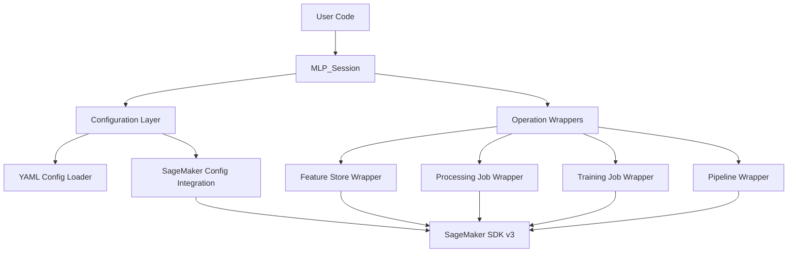

# Design Document: mlp_sdk

## Overview

The mlp_sdk is a Python wrapper library that simplifies SageMaker operations by providing a session-based interface with configuration-driven defaults. Built on top of the SageMaker Python SDK v3, it abstracts infrastructure complexity while maintaining full compatibility with the underlying SDK.

The core design philosophy is "convention over configuration" - users get sensible defaults for AWS resources (VPCs, security groups, S3 buckets) through YAML configuration files, while retaining the ability to override any setting when needed.

## Architecture

The mlp_sdk follows a layered architecture:



### Key Architectural Principles

1. **Single Entry Point**: All operations go through the `MLP_Session` object
2. **Configuration Hierarchy**: YAML defaults < SageMaker SDK defaults < Runtime parameters
3. **Lazy Loading**: Resources are only created when needed
4. **Transparent Passthrough**: Advanced users can access underlying SageMaker SDK objects
5. **Fail-Fast Validation**: Configuration and parameters are validated early

## Components and Interfaces

### MLP_Session

The main interface for all SDK operations:

```python
class MLP_Session:
    def __init__(self, config_path: Optional[str] = None, **kwargs):
        """Initialize session with optional custom config path"""
        
    def create_feature_group(self, name: str, **kwargs) -> FeatureGroup:
        """Create feature group with defaults"""
        
    def run_processing_job(self, job_name: str, **kwargs) -> ProcessingJob:
        """Execute processing job with defaults"""
        
    def run_training_job(self, job_name: str, **kwargs) -> TrainingJob:
        """Execute training job with defaults"""
        
    def create_pipeline(self, name: str, steps: List[PipelineStep]) -> Pipeline:
        """Create pipeline with consistent defaults"""
```

### Configuration Manager

Handles loading and merging configuration from multiple sources:

```python
class ConfigurationManager:
    def __init__(self, config_path: Optional[str] = None):
        """Load config from specified path or default location"""
        
    def get_default(self, key: str, fallback: Any = None) -> Any:
        """Get configuration value with fallback"""
        
    def merge_with_runtime(self, runtime_config: Dict) -> Dict:
        """Merge runtime parameters with defaults"""
```

### Operation Wrappers

Each SageMaker operation has a dedicated wrapper that applies defaults:

```python
class FeatureStoreWrapper:
    def create_feature_group(self, session: sagemaker.Session, 
                           config: Dict, **kwargs) -> FeatureGroup:
        """Create feature group with applied defaults"""

class ProcessingWrapper:
    def run_job(self, session: sagemaker.Session, 
                config: Dict, **kwargs) -> ProcessingJob:
        """Run processing job with applied defaults"""
```

## Data Models

### Configuration Schema

The YAML configuration follows this structure:

```yaml
# /home/sagemaker-user/.config/admin-config.yaml
defaults:
  # S3 Configuration
  s3:
    default_bucket: "my-sagemaker-bucket"
    input_prefix: "input/"
    output_prefix: "output/"
    model_prefix: "models/"
    
  # Networking Configuration  
  networking:
    vpc_id: "vpc-12345678"
    security_group_ids: ["sg-12345678"]
    subnets: ["subnet-12345678", "subnet-87654321"]
    
  # Compute Configuration
  compute:
    processing_instance_type: "ml.m5.large"
    training_instance_type: "ml.m5.xlarge"
    processing_instance_count: 1
    training_instance_count: 1
    
  # Feature Store Configuration
  feature_store:
    offline_store_s3_uri: "s3://my-sagemaker-bucket/feature-store/"
    enable_online_store: false
    
  # IAM Configuration
  iam:
    execution_role: "arn:aws:iam::123456789012:role/SageMakerExecutionRole"
    
  # KMS Configuration
  kms:
    key_id: "arn:aws:kms:REGION:ACCOUNT-ID:key/KEY-ID"
```

### Internal Configuration Model

```python
@dataclass
class MLPConfig:
    s3_config: S3Config
    networking_config: NetworkingConfig
    compute_config: ComputeConfig
    feature_store_config: FeatureStoreConfig
    iam_config: IAMConfig
    
@dataclass
class S3Config:
    default_bucket: str
    input_prefix: str = "input/"
    output_prefix: str = "output/"
    model_prefix: str = "models/"
```

## Correctness Properties

*A property is a characteristic or behavior that should hold true across all valid executions of a system-essentially, a formal statement about what the system should do. Properties serve as the bridge between human-readable specifications and machine-verifiable correctness guarantees.*

Now I need to analyze the acceptance criteria to determine which ones can be tested as properties:

Based on the prework analysis, I can identify the following testable properties:

### Property 1: Configuration Loading Behavior
*For any* MLP_Session initialization, the configuration should be loaded from the specified path (default or custom), and when no configuration exists, SageMaker SDK defaults should be used
**Validates: Requirements 2.1, 2.2, 2.3**

### Property 2: Configuration Validation
*For any* configuration provided during session initialization, invalid configurations should be rejected with validation errors
**Validates: Requirements 2.4**

### Property 3: Default Configuration Application
*For any* SageMaker operation (feature groups, processing jobs, training jobs), default values from Admin_Config should be applied when parameters are not explicitly provided
**Validates: Requirements 3.1, 3.2, 4.1, 4.2, 4.3, 5.1, 5.2, 5.3, 5.4**

### Property 4: Runtime Parameter Override
*For any* SageMaker operation, when runtime parameters are provided, they should override Admin_Config defaults while maintaining other defaults
**Validates: Requirements 3.5, 6.5**

### Property 5: Feature Store Type Support
*For any* feature group creation, both online and offline feature stores should be supported with appropriate defaults from configuration
**Validates: Requirements 3.3**

### Property 6: Processing Script Customization
*For any* processing job with custom scripts, the custom script should execute while infrastructure settings come from Admin_Config defaults
**Validates: Requirements 4.4**

### Property 7: Training Algorithm Support
*For any* training job, both built-in SageMaker algorithms and custom training containers should work with default configurations
**Validates: Requirements 5.5**

### Property 8: Pipeline Step Integration
*For any* pipeline creation, processing jobs, training jobs, and other steps should be properly connected with consistent default configurations and parameter passing support
**Validates: Requirements 6.1, 6.2, 6.3**

### Property 9: Pipeline Monitoring
*For any* pipeline execution, monitoring and status reporting functionality should be available
**Validates: Requirements 6.4**

### Property 10: Operation Logging
*For any* mlp_sdk operation, the operation should be logged at the appropriate configurable level
**Validates: Requirements 7.2**

### Property 11: Error Handling and Propagation
*For any* failed operation, AWS error details should be included in exceptions and input validation should occur before AWS API calls
**Validates: Requirements 7.3, 7.4**

### Property 12: Audit Trail Maintenance
*For any* mlp_sdk operation, an audit trail should be maintained for debugging and compliance purposes
**Validates: Requirements 7.5**

### Property 13: SageMaker SDK Default Precedence
*For any* configuration scenario, when SageMaker SDK provides default values, those should take precedence over custom defaults
**Validates: Requirements 8.2**

### Property 14: SDK Object Exposure
*For any* mlp_sdk operation, underlying SageMaker SDK objects should be accessible for advanced use cases
**Validates: Requirements 8.3**

### Property 15: Authentication Feature Support
*For any* authentication scenario, all SageMaker SDK authentication and session management features should be supported
**Validates: Requirements 8.5**

## Error Handling

The mlp_sdk implements a comprehensive error handling strategy:

### Error Categories

1. **Configuration Errors**: Invalid YAML syntax, missing required fields, invalid AWS resource references
2. **Validation Errors**: Invalid parameters, incompatible configurations, missing permissions
3. **AWS Service Errors**: SageMaker API failures, S3 access issues, IAM permission problems
4. **Runtime Errors**: Network timeouts, resource limits, job failures

### Error Handling Patterns

```python
class MLPSDKError(Exception):
    """Base exception for all mlp_sdk errors"""
    pass

class ConfigurationError(MLPSDKError):
    """Configuration loading or validation errors"""
    pass

class ValidationError(MLPSDKError):
    """Parameter validation errors"""
    pass

class AWSServiceError(MLPSDKError):
    """AWS service operation errors"""
    def __init__(self, message: str, aws_error: Exception):
        super().__init__(message)
        self.aws_error = aws_error
```

### Error Recovery Strategies

- **Configuration Fallback**: When custom config fails, fall back to SageMaker SDK defaults
- **Retry Logic**: Implement exponential backoff for transient AWS service errors
- **Validation Early**: Validate all inputs before making AWS API calls
- **Context Preservation**: Include operation context in all error messages

## Testing Strategy

The mlp_sdk employs a dual testing approach combining unit tests and property-based tests:

### Unit Testing Strategy

Unit tests focus on:
- **Configuration Loading**: Test specific config file formats and edge cases
- **Error Conditions**: Test specific error scenarios and error message content
- **Integration Points**: Test interaction with SageMaker SDK components
- **Mock Testing**: Test behavior with mocked AWS services

Example unit tests:
- Test loading valid YAML configuration files
- Test handling of missing configuration files
- Test specific AWS service error scenarios
- Test parameter validation for edge cases

### Property-Based Testing Strategy

Property-based tests validate universal behaviors across many inputs using a property-based testing library (pytest-hypothesis for Python):

**Configuration**: Each property test runs minimum 100 iterations with randomized inputs
**Tagging**: Each test references its design document property using the format:
`# Feature: MLP-sagemaker-sdk, Property {number}: {property_text}`

Property tests focus on:
- **Configuration Behavior**: Test configuration loading with various valid/invalid inputs
- **Default Application**: Test that defaults are consistently applied across operations
- **Override Behavior**: Test parameter precedence with various combinations
- **Error Propagation**: Test error handling across different failure scenarios

Example property tests:
- Generate random valid configurations and verify they load correctly
- Generate random SageMaker operation parameters and verify defaults are applied
- Generate random runtime overrides and verify they take precedence
- Generate random invalid inputs and verify appropriate errors are raised

### Test Organization

```
tests/
├── unit/
│   ├── test_configuration.py
│   ├── test_feature_store.py
│   ├── test_processing.py
│   ├── test_training.py
│   └── test_pipeline.py
├── property/
│   ├── test_config_properties.py
│   ├── test_operation_properties.py
│   └── test_error_properties.py
└── integration/
    ├── test_sagemaker_integration.py
    └── test_end_to_end.py
```

### Testing Dependencies

- **pytest**: Main testing framework
- **pytest-hypothesis**: Property-based testing library
- **moto**: AWS service mocking for unit tests
- **boto3-stubs**: Type hints for AWS SDK
- **pytest-mock**: Mocking utilities

The testing strategy ensures both specific behavior validation through unit tests and general correctness validation through property-based tests, providing comprehensive coverage of the mlp_sdk functionality.